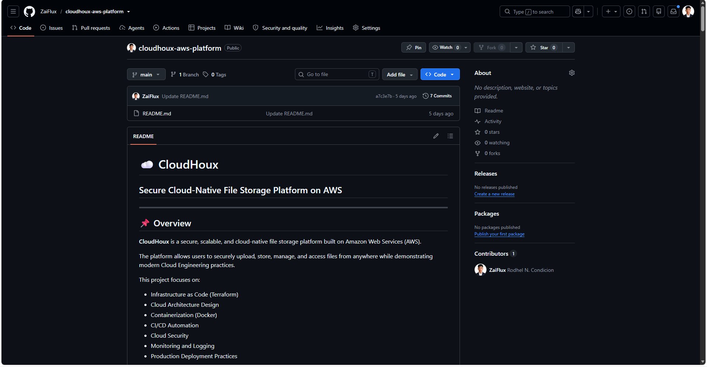
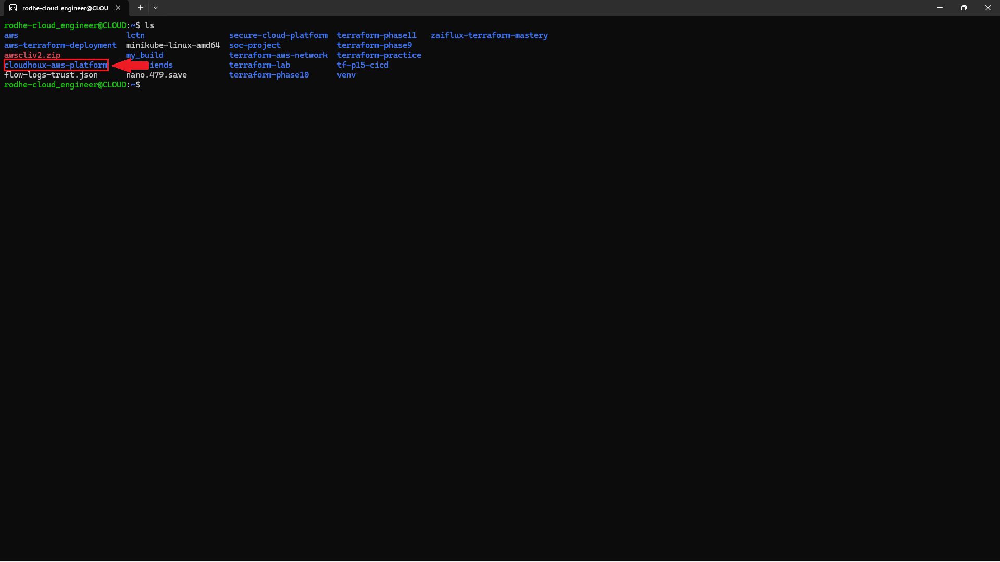
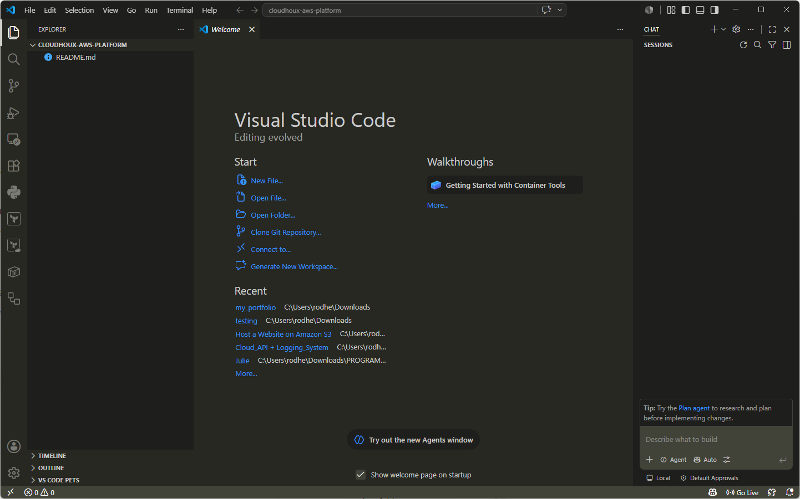
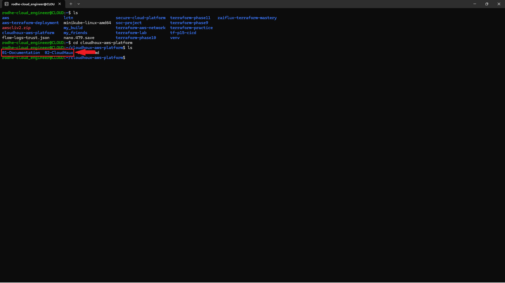
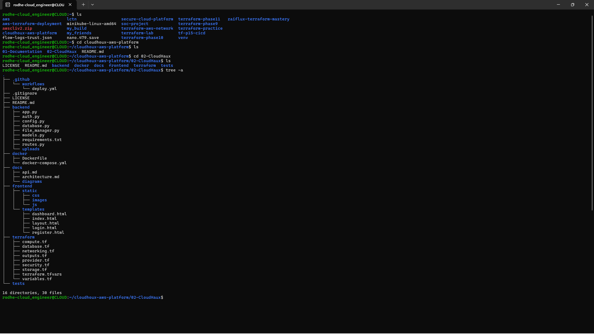
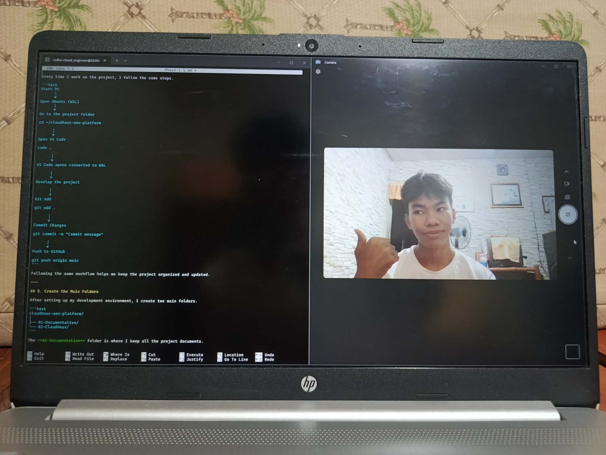

**Date:** 22/07/26

# Phase 1.1 – Repository Setup and Development Environment

## 1. Create the GitHub Repository

The first step is to create a GitHub repository for the project. This repository is where I store all the project files and source code. It also helps me keep track of all the changes that I make during development.


---

## 2. Clone the Repository to WSL

After creating the repository, I clone it to my WSL (Windows Subsystem for Linux). I choose to work in WSL because it is more convenient when using cloud engineering tools like Terraform, Docker, AWS CLI, and Git.

```bash
git clone https://github.com/ZaiFlux/cloudhoux-aws-platform.git
```

Go to the project folder.

```bash
cd ~/cloudhoux-aws-platform
```



---

## 3. Connect VS Code to WSL

To connect Visual Studio Code to WSL, I use the following command.

```bash
code .
```

This command opens the current folder in VS Code while connected to WSL. Most of my work is done in this environment because it is easier to manage the project.


---

## 4. My Daily Workflow

Every time I work on the project, I follow the same steps.

```text
Start PC
      │
      ▼
Open Ubuntu (WSL)
      │
      ▼
Go to the project folder

cd ~/cloudhoux-aws-platform

      │
      ▼
Open VS Code

code .

      │
      ▼
VS Code opens connected to WSL

      │
      ▼
Develop the project

      │
      ▼
Git Add

git add .

      │
      ▼
Commit Changes

git commit -m "Commit message"

      │
      ▼
Push to GitHub

git push origin main
```

Following the same workflow helps me keep the project organized and updated.

---

## 5. Create the Main Folders

After setting up my development environment, I create two main folders.

```text
cloudhoux-aws-platform/
│
├── 01-Documentation/
└── 02-CloudHoux/
```

The **01-Documentation** folder is where I keep all the project documents.

The **02-CloudHoux** folder is where I build the actual project.

This makes the repository cleaner and easier to manage.

**Figure 1.5 – Main Project Folders**



---

## 6. Build the Project Folder Structure

After creating the two main folders, I start building the project folder structure inside the **02-CloudHoux** folder. This is where all the source code and project files will be stored.

When the folder structure is finished, I push it to GitHub.

```bash
git add .
git commit -m "Create initial project structure"
git push origin main
```

This is the starting point of the CloudHoux project.



## 📸 Milestone Snapshot



*Figure 1.7 – Celebrating the successful completion of Phase 1.1 😆.*
