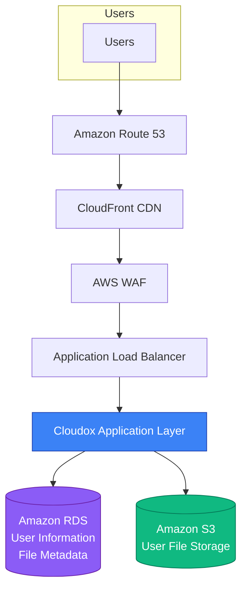
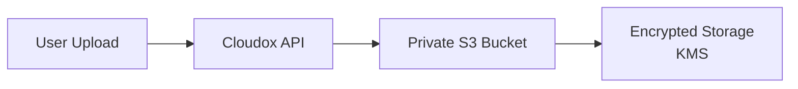
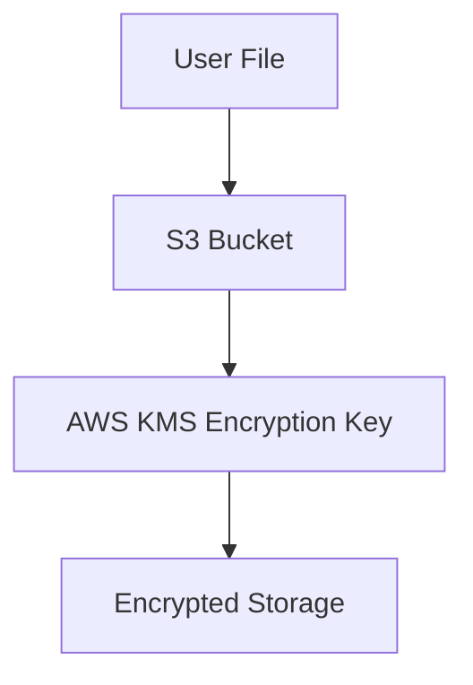
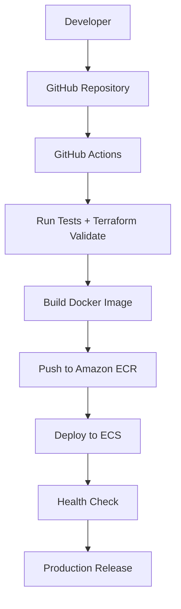
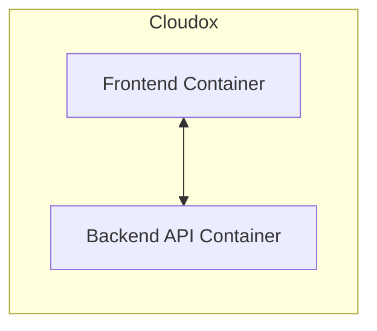
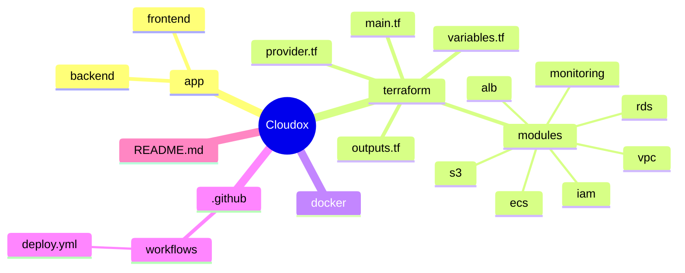

# ☁️ Cloudox
## Secure Cloud-Native File Storage Platform on AWS

---

## 📌 Overview

**Cloudox** is a secure, scalable, and cloud-native file storage platform built on Amazon Web Services (AWS).  
The platform allows users to securely upload, store, manage, and access files from anywhere while demonstrating modern Cloud Engineering practices.

**Focus Areas:**
- Infrastructure as Code (Terraform)
- Cloud Architecture Design
- Containerization (Docker)
- CI/CD Automation
- Cloud Security
- Monitoring and Logging
- Production Deployment Practices

---

## 🎯 Problem Statement

Traditional file storage solutions often face problems such as:
- Limited scalability
- Manual deployment processes
- Weak access control
- Lack of monitoring
- Data security concerns
- Difficulty managing infrastructure

**Cloudox** addresses these challenges with secure file storage, automated pipelines, scalable infrastructure, encryption, and full observability.

---

## 🏗️ Cloudox Architecture

---

## 🔄 File Upload Flow

---

## 🔐 Encryption Flow

---

## 🚀 CI/CD Pipeline

---

## 🐳 Container Architecture

---

## 🏗️ Project Structure

---

## 🌐 AWS Services Used

### Networking
- **Amazon VPC** – Isolated network with public/private subnets, NAT Gateway, Security Groups, NACLs

### Compute
- **Amazon ECS / EC2** – Runs containerized application with auto scaling

### Load Balancing
- **Application Load Balancer (ALB)** – Traffic distribution and health checks

### Storage
- **Amazon S3** – Secure, encrypted, versioned file storage

### Database
- **Amazon RDS** – Stores user data and file metadata (private subnet)

---

## 🔐 Security Architecture

- **IAM** – Least privilege roles and policies
- **KMS** – Encryption at rest for S3 and RDS
- **Secrets Manager** – Secure storage of credentials
- **CloudTrail** – API activity logging
- **GuardDuty** – Threat detection
- **AWS Config** – Compliance monitoring
- **CloudWatch** – Metrics, logs, and alarms

---

## 🌎 Application Features

### Current Features
- User registration & login
- File upload, download & delete
- File management dashboard

### Future Features
- File sharing links
- Storage quotas
- File preview
- AI-powered search
- Multi-region backup

---

## 🛠️ Technology Stack

**Frontend:** HTML, CSS, JavaScript (React planned)  
**Backend:** Python Flask / Node.js  
**Infrastructure:** Terraform  
**Containers:** Docker  
**CI/CD:** GitHub Actions  
**Cloud:** AWS (ECS, S3, RDS, etc.)

---

## 📅 Development Roadmap

### Phase 1 — Application Development
- [ ] Build frontend
- [ ] Create backend API
- [ ] Implement authentication
- [ ] Implement file upload/download

### Phase 2 — Docker
- [ ] Create Dockerfile(s)
- [ ] Build and test containers locally

### Phase 3 — AWS Infrastructure
- [ ] VPC + Networking
- [ ] ECS + ALB deployment
- [ ] RDS + S3 configuration

### Phase 4 — CI/CD
- [ ] GitHub Actions workflow
- [ ] Automated build, push to ECR, deploy to ECS

### Phase 5 — Security
- [ ] IAM roles & policies
- [ ] KMS encryption
- [ ] Secrets Manager integration
- [ ] Enable CloudTrail, GuardDuty, Config

### Phase 6 — Monitoring
- [ ] CloudWatch dashboards & alerts

---

## 📊 Skills Demonstrated

| Skill                  | Implementation                     |
|------------------------|------------------------------------|
| AWS Architecture       | Production-grade cloud design      |
| Terraform              | Infrastructure as Code             |
| Docker                 | Containerization                   |
| GitHub Actions         | CI/CD Pipeline                     |
| ECS                    | Container orchestration            |
| S3 + RDS               | Storage & Database                 |
| IAM + KMS              | Security & Encryption              |
| CloudWatch + GuardDuty | Monitoring & Threat Detection      |

---

## 👨‍💻 Author
**Rodhel N. Condicion**  
*Cloud Engineer Portfolio Project*

---

